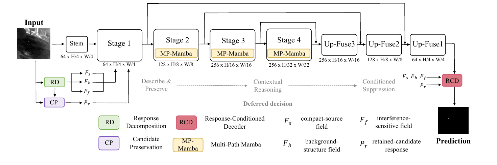
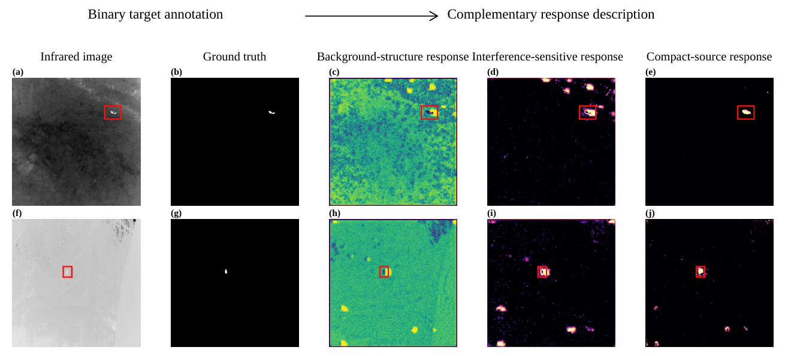
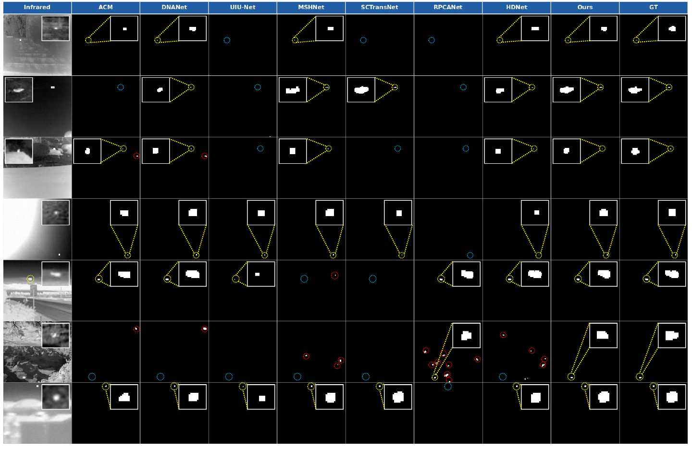

# DRC-Mamba

**Decomposition-Guided Response-Conditioning Mamba with Deferred Decision for Infrared Small Target Detection**

Official PyTorch implementation of **DRC-Mamba** for infrared small target detection (IRSTD).

DRC-Mamba follows a deferred-decision strategy for weak-target detection in complex infrared scenes. Instead of immediately suppressing locally ambiguous responses, the network first constructs complementary response descriptions and preserves plausible target candidates. Long-range structural context is then introduced through multi-path Mamba reasoning, followed by response-conditioned decoding for final target reconstruction and interference suppression.

## Results

Performance on the three IRSTD benchmarks is summarized below.

| Dataset | Train / Test | IoU ↑ | F1 ↑ | nIoU ↑ | Pd ↑ | Fa ↓ | Pretrained model |
|---|---:|---:|---:|---:|---:|---:|---|
| NUAA-SIRST | 341 / 86 | **82.91** | **90.66** | **82.16** | **99.08** | **0.99** | [Download](pretrained/drc_mamba_nuaa_sirst_best_iou.pth) |
| NUDT-SIRST | 663 / 664 | **89.65** | **94.54** | **90.39** | **98.62** | **6.69** | [Download](pretrained/drc_mamba_nudt_sirst_best_iou.pth) |
| IRSTD-1K | 800 / 201 | **73.72** | **84.87** | **68.65** | **91.58** | **10.38** | [Download](pretrained/drc_mamba_irstd1k_best_iou.pth) |

IoU, F1, nIoU, and Pd are reported in percentage (%). Fa denotes false-alarm pixels in unmatched predicted components per million evaluated pixels.

## Method



DRC-Mamba consists of four coordinated components:

1. **Response decomposition** constructs compact-source, background-structure, and interference-sensitive response fields to characterize locally ambiguous observations.
2. **Candidate-preservation branch (CP)** retains plausible weak-target responses and fine spatial details before strong suppression is applied.
3. **Multi-path Mamba (MP-Mamba)** introduces long-range structural context through complementary scanning paths to distinguish spatially isolated targets from structure-connected interference.
4. **Response-conditioned decoder (RCD)** regulates structure-related suppression according to target-supporting responses and reconstructs the final segmentation map.



*Complementary response fields for representative infrared scenes.*

### Qualitative Comparison



*Qualitative comparison on representative scenes containing weak targets, bright structures, and cluttered backgrounds.*

## Environment

The experiments were conducted with the following environment:

| Package | Version |
|---|---|
| Python | 3.10 |
| PyTorch | 2.1.1 + CUDA 11.8 |
| torchvision | 0.16.1 + CUDA 11.8 |
| mamba-ssm | 1.1.3 |
| causal-conv1d | 1.1.3.post1 |
| einops | 0.8.1 |
| NumPy | 1.26.4 |
| scikit-image | 0.22.0 |

Clone the repository:

```bash
git lfs install
git clone https://github.com/hhansan27-dotcom/DRC-Mamba.git
cd DRC-Mamba
```

Create the environment and install the dependencies:

```bash
conda create -n drc-mamba python=3.10 -y
conda activate drc-mamba

pip install torch==2.1.1 torchvision==0.16.1 --index-url https://download.pytorch.org/whl/cu118
pip install -r requirements.txt
```

## Datasets

The datasets used in the experiments are publicly available from the following repositories:

- **IRSTD-1K:** [RuiZhang97/ISNet](https://github.com/RuiZhang97/ISNet)
- **NUAA-SIRST:** [YimianDai/sirst](https://github.com/YimianDai/sirst)
- **NUDT-SIRST:** [YeRen123455/Infrared-Small-Target-Detection](https://github.com/YeRen123455/Infrared-Small-Target-Detection)

The train/test split files used in our experiments are included in this repository. After downloading the datasets, arrange the images and masks as follows:

```text
dataset/
├── NUAA-SIRST/
│   ├── images/
│   ├── masks/
│   └── 80_20/
│       ├── train.txt
│       └── test.txt
├── NUDT-SIRST/
│   ├── images/
│   ├── masks/
│   └── 50_50/
│       ├── train.txt
│       └── test.txt
└── IRSTD-1K/
    ├── images/
    ├── masks/
    └── 80_20/
        ├── train.txt
        └── test.txt
```

Each split file contains one image ID per line without the file extension. Images and masks are read as single-channel images, and `.png` is used by default.

## Evaluation

Evaluate the released checkpoints using the following commands. The binary threshold used for the reported results is **0.5**.

### NUAA-SIRST

```bash
python evaluate.py \
  --checkpoint pretrained/drc_mamba_nuaa_sirst_best_iou.pth \
  --dataset NUAA-SIRST \
  --split 80_20
```

### NUDT-SIRST

```bash
python evaluate.py \
  --checkpoint pretrained/drc_mamba_nudt_sirst_best_iou.pth \
  --dataset NUDT-SIRST \
  --split 50_50
```

### IRSTD-1K

```bash
python evaluate.py \
  --checkpoint pretrained/drc_mamba_irstd1k_best_iou.pth \
  --dataset IRSTD-1K \
  --split 80_20
```

Predictions are resized to the original image resolution before metric computation.

## Training

The main training settings used in the experiments are:

| Setting | Value |
|---|---:|
| Input size | 512 × 512 |
| Epochs | 400 |
| Batch size | 4 |
| Optimizer | AdamW |
| Initial learning rate | 1 × 10⁻⁴ |
| Weight decay | 1 × 10⁻⁴ |
| Warm-up epochs | 20 |
| Learning-rate schedule | Warm-up + cosine annealing |
| Normalization | GroupNorm |
| Mamba state dimension | 16 |
| Mamba expansion ratio | 2 |

Training commands:

```bash
python train.py --dataset NUAA-SIRST --split 80_20
python train.py --dataset NUDT-SIRST --split 50_50
python train.py --dataset IRSTD-1K --split 80_20
```

Dataset-specific launch scripts are also provided in [`scripts/`](scripts/).

## Evaluation Protocol

The evaluation protocol follows the manuscript:

- **IoU:** foreground intersection over union accumulated over the complete test set.
- **F1:** computed from accumulated IoU as `2 × IoU / (1 + IoU)`.
- **nIoU:** mean image-wise IoU.
- **Pd:** target-level detection probability based on one-to-one nearest-centroid matching of eight-connected components.
- **Fa:** pixels belonging to unmatched predicted components per million evaluated pixels.

A predicted component is matched to a ground-truth target when the centroid distance is less than **3 pixels**. The binary threshold is fixed at **0.5** for the tabulated results. No connected-component filtering or morphological post-processing is applied.

## Citation

If you find this work useful in your research, please cite:

```bibtex
@misc{zhang2026drcmamba,
  title  = {Decomposition-Guided Response-Conditioning Mamba with Deferred Decision for Infrared Small Target Detection},
  author = {Zhang, Tongliga and Sun, Yingjie and Huang, Shize and Li, Hongjie and Zheng, Yitao and Zhang, Ping},
  year   = {2026},
  note   = {Manuscript submitted to Infrared Physics & Technology},
  url    = {https://github.com/hhansan27-dotcom/DRC-Mamba}
}
```
